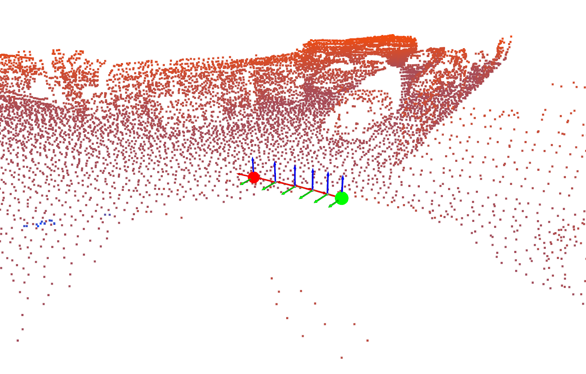

# LiDAR Odometry for Beginner



A hands-on tutorial for learning LiDAR odometry implementation from the ground up using Python.

## 📚 Complete Tutorial Guide

This repository includes a comprehensive PDF guide that explains the theory and implementation details:
- **📖 [Lidar_odometry_for_beginner.pdf](Lidar_odometry_for_beginner.pdf)** - Read this alongside the code for complete understanding

The PDF covers mathematical foundations, algorithm explanations, and implementation strategies that complement the practical code examples in this repository.

## Overview

This repository provides a step-by-step guide to implementing LiDAR odometry, bridging the gap between complex mathematical theory and practical, working code. The tutorial is designed for those who understand the basic concepts but struggle with actual implementation.

### Why This Tutorial?

- **Theory-to-Practice Gap**: Many resources explain *what* needs to be done, but few show *how* to implement it line by line
- **Language Accessibility**: Uses Python instead of C++ to focus on core principles without language barriers
- **Progressive Learning**: Each chapter builds upon the previous one, from basic visualization to complete odometry systems
- **Real Data**: Works with actual KITTI dataset sequences for realistic learning

### Important Note

This Python implementation prioritizes understanding over performance. For real-time applications, consider the advanced C++ version after mastering the concepts here:
- **Advanced C++ Implementation**: [lidar_odometry](https://github.com/93won/lidar_odometry)

## Table of Contents

### Chapter 1: LiDAR Data Visualization
- Basic point cloud loading and visualization
- Understanding LiDAR data structure
- Introduction to Open3D for 3D visualization

### Chapter 2: Point-to-Plane ICP
- Implementation of Iterative Closest Point (ICP) algorithm
- Point-to-plane distance minimization
- SE(3) pose estimation and optimization
- Gauss-Newton solver implementation

### Chapter 3: Sequential Local Mapping
- Building local maps from multiple frames
- Sequential pose estimation
- Local map management and optimization
- Complete LiDAR odometry pipeline

## Quick Start

### Prerequisites
```bash
# Install required packages
pip install -r requirements.txt
```

### Running the Examples

**Chapter 1 - Visualization:**
```bash
cd chapter1
python visualize_lidar.py
```

**Chapter 2 - Point-to-Plane ICP:**
```bash
cd chapter2
python run_icp.py
```

**Chapter 3 - Sequential Local Mapping:**
```bash
cd chapter3
python run_sequential_local_mapping.py
python visualize_sequential_mapping.py
```

## Data

The tutorial uses KITTI dataset sequences. Sample data is included in each chapter's `data/` directory.

## Key Features

- **Educational Focus**: Clear, commented code with step-by-step explanations
- **Modular Design**: Each component is implemented separately for easy understanding
- **Visualization**: Rich 3D visualizations to understand algorithm behavior
- **Progressive Complexity**: From simple concepts to complete systems

## Learning Path

1. **Start with Chapter 1** to understand LiDAR data and visualization
2. **Progress to Chapter 2** to learn ICP and pose estimation
3. **Complete Chapter 3** to build a full odometry system

## Dependencies

- Python 3.8+
- NumPy
- SciPy
- Open3D
- Matplotlib

## Contributing

This tutorial is designed to be educational. If you find areas for improvement or have suggestions, please feel free to contribute.

## License

MIT License - See LICENSE file for details.

## Acknowledgments

This tutorial was inspired by the need to make LiDAR odometry more accessible to beginners. Special thanks to the open-source SLAM community for their foundational work.

---

*"This guide aims to be a small lantern on your learning journey, lowering the barrier to entry into the fascinating world of LiDAR Odometry."*
